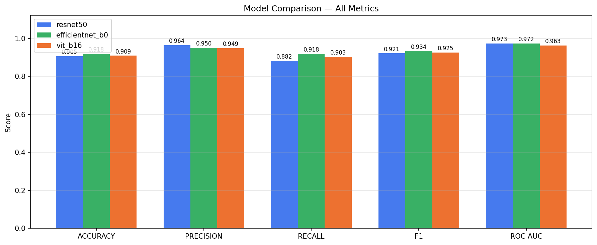
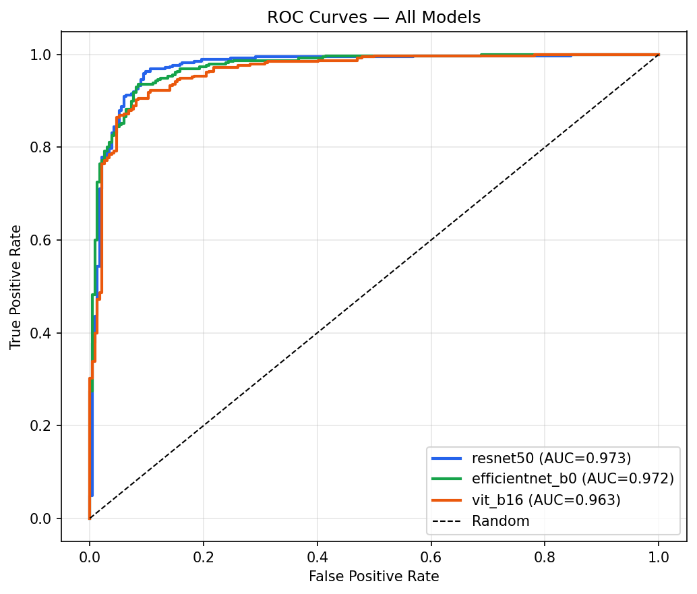
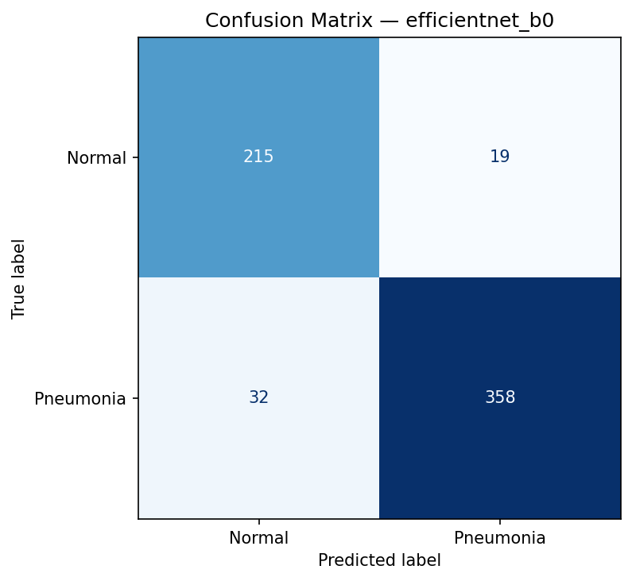

# Pneumonia Detection from Chest X-Rays

[](https://pytorch.org/)
[](https://streamlit.io/)
[](https://www.docker.com/)

A comparative deep learning study for binary pneumonia classification from chest X-rays, benchmarking **ResNet50**, **EfficientNet-B0**, and **Vision Transformer (ViT-B/16)** with PyTorch transfer learning — plus a deployable Streamlit app with Grad-CAM explainability.

Trained and evaluated on the [Chest X-Ray Pneumonia dataset](https://www.kaggle.com/datasets/paultimothymooney/chest-xray-pneumonia) (5,863 images, NORMAL vs. PNEUMONIA).



---

## Results

| Model | Accuracy | Precision | Recall | F1 | ROC-AUC | Inference (ms) | Params |
|-------|:--------:|:---------:|:------:|:--:|:-------:|:---------------:|:------:|
| ResNet50 | 90.5% | 0.964 | 0.882 | 0.921 | 0.973 | 1.27 | 23.5M |
| **EfficientNet-B0** | **91.8%** | 0.950 | **0.918** | **0.934** | 0.972 | **0.65** | **4.0M** |
| ViT-B/16 | 90.9% | 0.949 | 0.903 | 0.925 | 0.963 | 0.43 | 85.8M |

EfficientNet-B0 gives the best accuracy/F1 at a fraction of ResNet50's parameter count. Recall is the metric to optimize in this task — a false negative (missing real pneumonia) is the costly error in a screening setting, which is why it's reported alongside accuracy rather than in place of it.

<table>
<tr><td></td><td></td></tr>
</table>

---

## Live Demo & Deployment

The Streamlit app supports model selection, real-time X-ray upload, per-class confidence scores, and Grad-CAM visualizations of what each model attends to. It's containerized (`Dockerfile`) and ready to deploy to Hugging Face Spaces or any Docker host.

```bash
streamlit run app/streamlit_app.py
```

---

## Project Structure

```
├── src/
│   ├── config.py        # All hyperparameters (single source of truth)
│   ├── dataset.py       # ChestXRayDataset + DataLoader factory
│   ├── models.py        # ResNet50, EfficientNet-B0, ViT builders
│   ├── train.py         # Two-phase training loop + early stopping
│   ├── evaluate.py      # Metrics, confusion matrix, ROC-AUC, plots
│   └── utils.py         # Seed, device, checkpoint loading
├── app/
│   └── streamlit_app.py # Web application with Grad-CAM
├── notebooks/
│   └── 01_eda.py        # Dataset analysis
├── results/              # Metrics, comparison table, plots
├── run_training.py       # Entry point: train models
├── run_evaluation.py     # Entry point: evaluate + generate plots
├── Dockerfile
└── requirements.txt
```

---

## Setup

### 1. Install dependencies

```bash
# CPU
pip install -r requirements.txt

# GPU (CUDA 11.8)
pip install torch torchvision --index-url https://download.pytorch.org/whl/cu118
pip install -r requirements.txt
```

The dataset downloads automatically via `kagglehub` on first run — no manual download needed.

### 2. Run EDA

```bash
python notebooks/01_eda.py
```

### 3. Train

```bash
python run_training.py                          # all three models
python run_training.py --model efficientnet_b0   # a single model
```

### 4. Evaluate

```bash
python run_evaluation.py
```

Plots are written to `results/plots/`, metrics to `results/comparison_table.csv`.

### 5. Run the app

```bash
streamlit run app/streamlit_app.py
```

---

## Design Decisions

- **Grayscale → RGB**: all three backbones are ImageNet-pretrained and expect 3-channel input, so grayscale X-rays are replicated across R/G/B.
- **Class imbalance (~74% Pneumonia / ~26% Normal)**: handled with a `WeightedRandomSampler` plus weighted cross-entropy — without it, the model trivially predicts Pneumonia for everything and still scores ~74% accuracy.
- **Two-phase training**: phase 1 (epochs 1–10) trains only the classifier head with the backbone frozen (LR=1e-3); phase 2 fine-tunes the last backbone stage at LR=1e-4.
- **Why ViT underperforms here**: it lacks the CNN's built-in inductive biases (locality, translation equivariance), which matters more on a mid-sized medical imaging dataset than on the large-scale data ViT was designed for.
- **Recall over raw accuracy**: reported and monitored explicitly, since a false negative in a screening tool is the failure mode that matters clinically.

---

## License

This project is provided as-is for portfolio and research purposes. The dataset is subject to its [original license](https://www.kaggle.com/datasets/paultimothymooney/chest-xray-pneumonia) on Kaggle.
